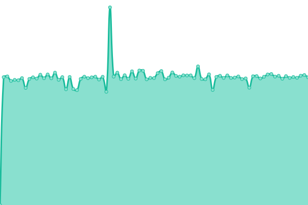
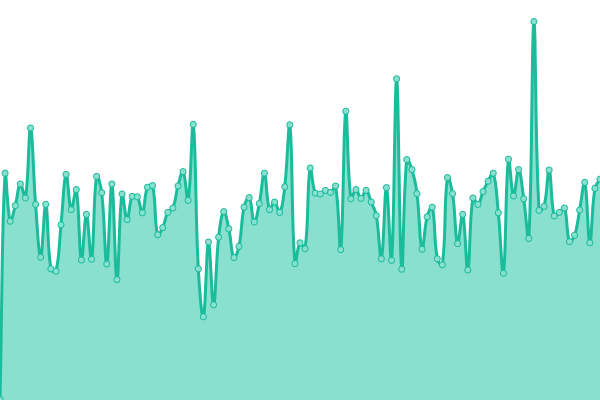
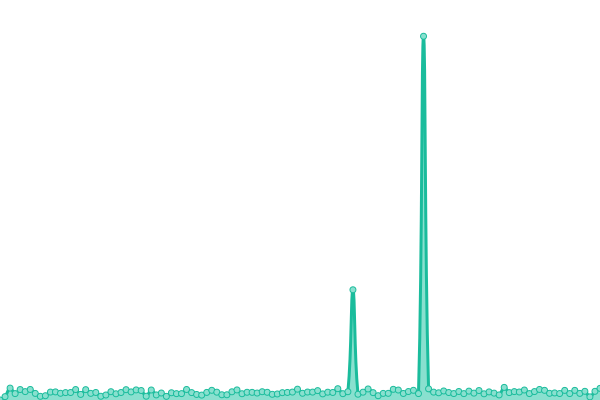

# [📈 Live Status](https://status.librescore.org): <!--live status--> **🟧 Partial outage**

This repository contains the open-source uptime monitor and status page for [LibreScore](https://librescore.org/), powered by [Upptime](https://github.com/upptime/upptime).

With [Upptime](https://upptime.js.org), you can get your own unlimited and free uptime monitor and status page, powered entirely by a GitHub repository. We use [Issues](https://github.com/LibreScore/status/issues) as incident reports, [Actions](https://github.com/LibreScore/status/actions) as uptime monitors, and [Pages](https://status.librescore.org) for the status page.

<!--start: status pages-->
<!-- This summary is generated by Upptime (https://github.com/upptime/upptime) -->
<!-- Do not edit this manually, your changes will be overwritten -->
<!-- prettier-ignore -->
| URL | Status | History | Response Time | Uptime |
| --- | ------ | ------- | ------------- | ------ |
|  [LibreScore App](https://status.librescore.org/app-server) | 🟩 Up | [libre-score-app.yml](https://github.com/LibreScore/status/commits/HEAD/history/libre-score-app.yml) | 

 1298ms
     
 | 

<a href="https://status.librescore.org/history/libre-score-app">99.71%</a>
    

|  [LibreScore Weblate](https://weblate.librescore.org/) | 🟩 Up | [libre-score-weblate.yml](https://github.com/LibreScore/status/commits/HEAD/history/libre-score-weblate.yml) | 

 492ms
     
 | 

<a href="https://status.librescore.org/history/libre-score-weblate">99.86%</a>
    

|  IPFS Service | 🟥 Down | [ipfs-service.yml](https://github.com/LibreScore/status/commits/HEAD/history/ipfs-service.yml) | 

 453ms
     
 | 

<a href="https://status.librescore.org/history/ipfs-service">0.00%</a>
    

<!--end: status pages-->

[**Visit our status website →**](https://status.librescore.org)

## 📄 License

- Powered by: [Upptime](https://github.com/upptime/upptime)
- Code: [MIT](./LICENSE) © [LibreScore](https://librescore.org/)
- Data in the `./history` directory: [Open Database License](https://opendatacommons.org/licenses/odbl/1-0/)
